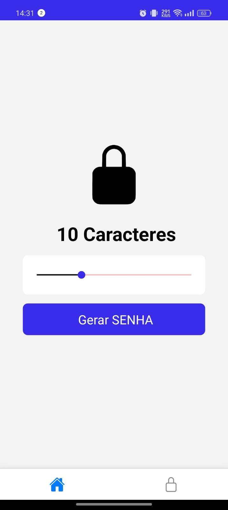
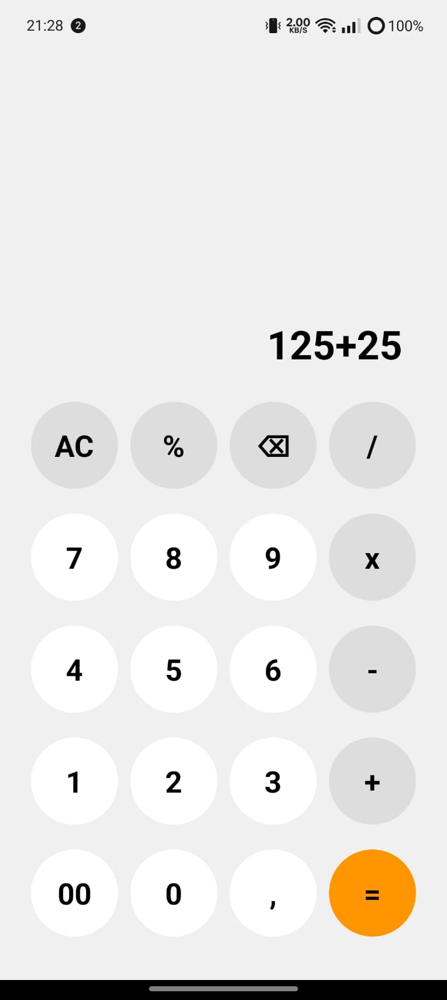
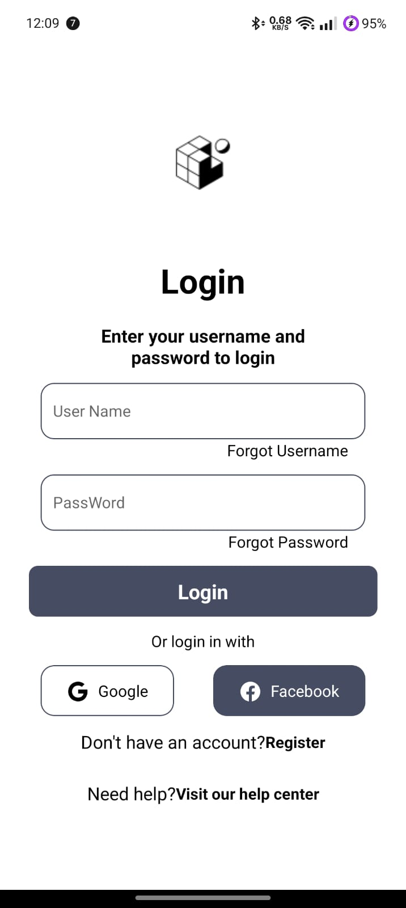

# Projetos Básicos em Desenvolvimento REACT-NATIVE

Este repositório contém uma coleção de projetos básicos que desenvolvi para explorar e praticar diferentes tecnologias e conceitos de programação. Cada projeto é independente e serve como um ponto de partida para futuros desenvolvimentos mais complexos.

## 📃 Índice de Projetos

1. Gerador de Senhas em React Native

- Descrição: Um aplicativo em React Native que gera senhas aleatórias de 6 a 20 caracteres e as salva no dispositivo. Utiliza Async Storage para armazenamento local, com duas telas principais: Home e Lista de Senhas.
- Tecnologias: React Native, Async Storage, Expo
- 
- [Readme Gerador de senhas](./gerador-de-senhas/README.md "gerador de senhas")
2. Calculadora

- Descrição: Um aplicativo em React Native que é uma calculadora Comum com funções básicas de soma, subtração, divisão, multiplicação e porcentagem.
- Tecnologias: React Native,Expo
- 
- [Readme calculadora](./calculadora/README.md "Calculadora")
3. Tela Login

- Descrição: Um aplicativo em React Native que mostra uma tela de login estática
- Tecnologias: React Native,Expo
- 
- [Readme tela-login](./tela-login/README.md "Tela login")

## 🚀 Objetivo

O objetivo deste repositório é reunir e documentar projetos de aprendizado em desenvolvimento de software, explorando, varias partes do react native. Assim podendo desenvolver uma base solida nesse framework.

## 🤷‍♂️ Como Usar

Para explorar cada projeto:

- Navegue até a pasta do projeto de interesse.
- Leia o README específico do projeto para detalhes sobre a configuração e execução.

<h2 id="colab">✒️ Agradecimentos</h2>

<table style="border-collapse: collapse; width: 100%;">
  <tr>
    <td style="padding: 20px; border: 1px solid #ccc; text-align: center;">
      <a href="https://github.com/alyssonrafael" style="text-decoration: none;">
         
        <b>Alysson Rafael</b>
      </a>
    </td>
    <td style="padding: 20px; border: 1px solid #ccc;">
Gostaria de expressar minha mais profunda gratidão a todos que contribuíram para este projeto. Cada sugestão, correção de bug e palavra de incentivo teve um impacto enorme. Sua ajuda não só melhorou o projeto, mas também me motivou a continuar. 🚀 Obrigado por estarem ao meu lado nessa jornada!
    </td>
  </tr>
</table>
