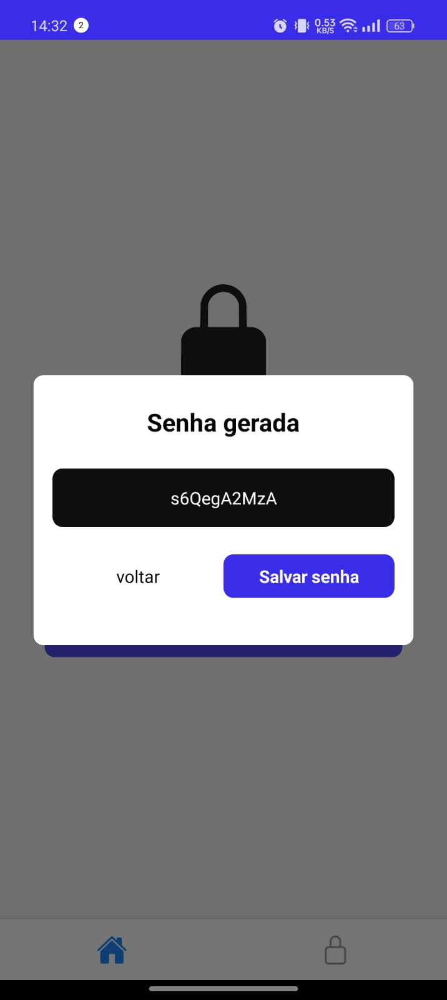
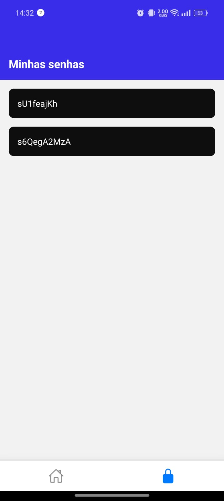

# Gerador de senhas

Um aplicativo básico de gerador de senhas desenvolvido em React Native, capaz de gerar senhas aleatórias de 6 a 20 caracteres e salvar senhas desejadas usando Async Storage.

## Funcionalidades

- Geração de senhas aleatórias de 6 a 20 caracteres
- Salvamento de senhas desejadas em armazenamento local
- Exibição de senhas salvas na lista
- Exclusão de senhas armazenadas

## Pré-Requesitos

- Node.js instalado
- Expo CLI instalada

## Como Executar Localmente

Para rodar localmente o projeto, siga estas etapas:

- 1 **Clone o repositório**:

```bash
git clone https://github.com/alyssonrafael/React-Native-Projetos-Basicos
```

- 2 **Navegue ate o projeto**:

```bash
    cd gerador-de-senhas
```

- 3 **Instale as dependências**:

```bash
    npm install
```

- 4 **Execute o servidor de desenvolvimento**:

```bash
     npm expo start
```

- 5 **Teste o aplicativo pelo app do expoGo**
  - Após as etapas acima o usuario pode estar testando o app usando o expo go que e obtido na Google Play ou APP store e lendo o QR code gerado no terminal da aplicação

## Aprendizados

Este foi meu primeiro projeto em React Native, onde pude aprender e aplicar alguns conceitos fundamentais para o desenvolvimento de aplicativos móveis. Alguns dos principais aprendizados incluem:

- Configuração do Ambiente: Experimentei a configuração e execução de um ambiente de desenvolvimento com Expo, o que facilitou o teste do aplicativo em diferentes dispositivos.
- Async Storage: Utilizei o Async Storage para armazenamento local de dados, que foi essencial para salvar as senhas geradas. Esse processo me ensinou como gerenciar dados de forma persistente no dispositivo.
- Hooks Personalizados: Desenvolvi um hook personalizado para salvar, listar e remover as senhas, o que me ajudou a entender melhor o potencial dos hooks em React e a prática de reutilizar lógica de estado.
- Navegação entre Telas: Configurei navegação básica entre telas (Home e Lista de Senhas), aprendendo a importância de uma experiência fluida para o usuário.

## Screenshots

| Tela Home                                                         | Tela de Geração de Senha                                           | Tela Minhas Senhas                                                         |
| ----------------------------------------------------------------- | ------------------------------------------------------------------ | -------------------------------------------------------------------------- |
|  |  |  |
