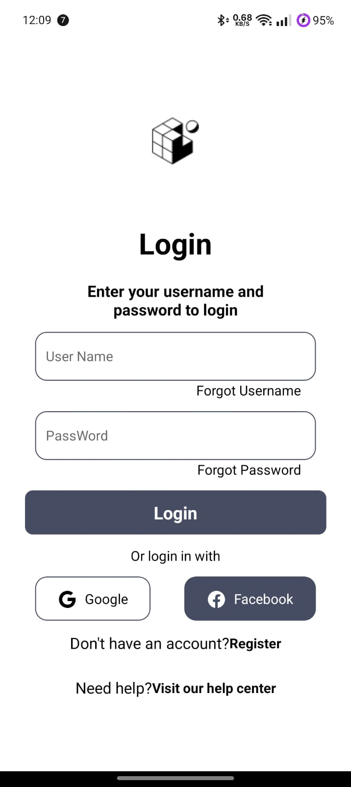

# Tela de Login

Um app básico com uma copia de um layout de uma tela login estática do figma

## Pré-Requisitos

* Node.js instalado
* Expo CLI instalada

## Como Executar Localmente

Para rodar localmente o projeto, siga estas etapas:

1. **Clone o repositório** :

```
git clone https://github.com/alyssonrafael/React-Native-Projetos-Basicos
```

2. **Navegue até o projeto** :

```
cd tela-login
```

3. **Instale as dependências** :

```
npm install
```

4. **Execute o servidor de desenvolvimento** :

```
npx expo start
```

5. **Teste o aplicativo pelo app do Expo Go**

   * Após as etapas acima, você pode testar o app usando o Expo Go, que pode ser baixado na Google Play ou App Store. Basta abrir o aplicativo e escanear o QR code gerado no terminal para rodar o app no seu dispositivo.

## Aprendizados

Este projeto foi uma atividade da faculdade e me ajudou a entender o básico do desenvolvimento mobile com React Native.  Foi uma boa oportunidade para praticar a montagem de layout basico.

### Imagem do app


